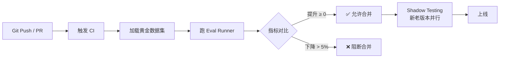

---
tags: [LLM, Agent, Eval, RAGAS, LLMasJudge]
created: 2026-05-22
---

# Agent 自动化评测系统 (Eval)

> 阿里核心原则：**没有 Eval 就无法上线。** Prompt 改了一个词、Chunking 策略换了一个参数，系统到底变好还是变坏了？只有量化评测才能回答。

---

## 一、为什么需要 Eval

### 定性 vs 定量

| 方式 | 方法 | 问题 |
|------|------|------|
| 人工评测 | 工程师手动测试几个 case | 抽样少、主观、不可重复 |
| A/B 测试 | 线上流量切分 | 风险高、周期长、无法快速迭代 |
| **自动化 Eval** | 黄金数据集 + 指标计算 | **可重复、可对比、可集成 CI/CD** |

### 核心价值

```
Prompt 修改 → Eval 跑分 → 指标对比 → 有信心发布
```

---

## 二、黄金数据集构建

### 数据结构

```python
from dataclasses import dataclass, field
import json


@dataclass
class GoldenSample:
    """黄金数据集的单条样本"""
    id: str
    question: str
    ground_truth_answer: str          # 人工标注的标准答案
    ground_truth_contexts: list[str]  # 应该被检索到的文档片段
    expected_tool_calls: list[str] = field(default_factory=list)  # 期望的工具调用序列
    tags: list[str] = field(default_factory=list)  # 用于分类分析（如 "multi-hop", "code"）
    difficulty: str = "medium"        # easy | medium | hard


@dataclass
class EvalResult:
    """单条评测结果"""
    sample_id: str
    question: str
    generated_answer: str
    retrieved_contexts: list[str]
    # 各维度分数（0-1）
    faithfulness: float = 0.0
    context_precision: float = 0.0
    context_recall: float = 0.0
    answer_relevancy: float = 0.0
    # 综合分
    overall_score: float = 0.0
    passed: bool = False


def load_golden_dataset(path: str) -> list[GoldenSample]:
    """从 JSONL 文件加载黄金数据集"""
    samples = []
    with open(path) as f:
        for line in f:
            data = json.loads(line)
            samples.append(GoldenSample(**data))
    return samples


def save_golden_dataset(samples: list[GoldenSample], path: str):
    """保存黄金数据集（增量追加）"""
    with open(path, "a") as f:
        for s in samples:
            f.write(json.dumps(s.__dict__, ensure_ascii=False) + "\n")
```

---

## 三、LLM-as-a-Judge 实现

⭐ **阿里面试高频考点**：如何让 LLM 做可靠的裁判？

### 关键设计原则
1. **CoT + 结构化输出**：强制先推理再打分，避免跳步
2. **分维度打分**：粒度细化，便于归因
3. **避免位置偏见**：对比两个答案时随机交换顺序

```python
import json
from openai import OpenAI
from dataclasses import dataclass

client = OpenAI()


@dataclass
class JudgeScore:
    correctness: float      # 回答是否正确
    relevancy: float        # 是否回答了问题
    completeness: float     # 是否覆盖了问题的所有方面
    reasoning: str          # 推理过程
    overall: float
    passed: bool            # >= 0.7 则 passed


JUDGE_PROMPT = """你是一个严格的 AI 系统评审专家。请评审以下问答对的质量。

【问题】
{question}

【参考答案（Ground Truth）】
{ground_truth}

【待评审答案】
{generated_answer}

请按以下步骤操作：
1. 先写出你的分析推理过程（3-5句话）
2. 然后输出评分 JSON

评分维度（每项 0.0-1.0）：
- correctness：事实是否正确，与 Ground Truth 一致
- relevancy：是否直接回答了问题，没有跑题
- completeness：是否覆盖了 Ground Truth 中的所有关键点

最后输出（严格 JSON，不要有其他内容）：
{{
  "reasoning": "你的分析...",
  "correctness": 0.9,
  "relevancy": 0.8,
  "completeness": 0.7,
  "overall": 0.8,
  "passed": true
}}

passed = true 的条件：overall >= 0.7"""


def llm_judge(
    question: str,
    ground_truth: str,
    generated_answer: str,
) -> JudgeScore:
    """
    LLM-as-a-Judge 评审
    使用 CoT + 分维度打分，避免简单的 "好/坏" 判断
    """
    prompt = JUDGE_PROMPT.format(
        question=question,
        ground_truth=ground_truth,
        generated_answer=generated_answer,
    )
    response = client.chat.completions.create(
        model="gpt-4o-mini",
        messages=[{"role": "user", "content": prompt}],
        temperature=0,  # 评审任务必须用 0 温度保证可重复性
    )
    content = response.choices[0].message.content

    # 提取 JSON（模型可能在前面输出了分析文字）
    json_start = content.rfind("{")
    json_end = content.rfind("}") + 1
    data = json.loads(content[json_start:json_end])

    return JudgeScore(
        correctness=data["correctness"],
        relevancy=data["relevancy"],
        completeness=data["completeness"],
        reasoning=data["reasoning"],
        overall=data["overall"],
        passed=data["passed"],
    )


# 测试
score = llm_judge(
    question="vLLM 的 PagedAttention 解决了什么问题？",
    ground_truth="解决了 KV Cache 的显存碎片问题，通过分页机制动态分配显存，将 Batch Size 提升 2-4 倍。",
    generated_answer="PagedAttention 是 vLLM 的核心特性，它借鉴操作系统的虚拟内存分页机制管理显存。",
)
print(f"评分: {score.overall:.2f} | 通过: {score.passed}")
print(f"推理: {score.reasoning}")
```

---

## 四、RAGAS 指标实现

### 4.1 Faithfulness（忠实度 / 幻觉检测）

**核心思路**：将生成的回答拆解为多个 Claim，逐一验证是否有 Context 支撑。

```python
def compute_faithfulness(
    answer: str,
    contexts: list[str],
) -> float:
    """
    Faithfulness = 有 Context 支撑的 Claim 数 / 总 Claim 数
    
    高 Faithfulness → 模型没有"编造"，完全基于检索内容回答
    """
    context_str = "\n\n".join(f"[{i+1}] {c}" for i, c in enumerate(contexts))

    # Step 1: 将 answer 拆解为原子化的 Claims
    decompose_response = client.chat.completions.create(
        model="gpt-4o-mini",
        messages=[
            {
                "role": "user",
                "content": f"""将以下回答拆解为独立的、原子化的陈述句（Claims）。
每行一个 Claim，不要编号。
只输出 Claims，不要其他内容。

回答：{answer}""",
            }
        ],
        temperature=0,
    )
    claims = [
        c.strip()
        for c in decompose_response.choices[0].message.content.splitlines()
        if c.strip()
    ]

    if not claims:
        return 0.0

    # Step 2: 逐个验证 Claim 是否有 Context 支撑
    supported_count = 0
    for claim in claims:
        verify_response = client.chat.completions.create(
            model="gpt-4o-mini",
            messages=[
                {
                    "role": "user",
                    "content": f"""以下参考资料中是否包含支持该陈述的信息？

参考资料：
{context_str}

陈述：{claim}

只回答 "YES" 或 "NO"：""",
                }
            ],
            temperature=0,
        )
        verdict = verify_response.choices[0].message.content.strip().upper()
        if "YES" in verdict:
            supported_count += 1

    faithfulness = supported_count / len(claims)
    print(f"  Faithfulness: {faithfulness:.2f} ({supported_count}/{len(claims)} claims supported)")
    return faithfulness


### 4.2 Context Precision（上下文精度）

def compute_context_precision(
    question: str,
    contexts: list[str],
    ground_truth: str,
) -> float:
    """
    Context Precision = 有用 chunks 在检索结果前 K 位的加权精度
    
    衡量：检索出的内容是否有用（排名越靠前的 chunk 越重要）
    """
    relevance_flags = []
    for i, ctx in enumerate(contexts):
        response = client.chat.completions.create(
            model="gpt-4o-mini",
            messages=[
                {
                    "role": "user",
                    "content": f"""判断以下文档片段是否有助于回答该问题。

问题：{question}
文档片段：{ctx}

只回答 "YES" 或 "NO"：""",
                }
            ],
            temperature=0,
        )
        is_relevant = "YES" in response.choices[0].message.content.upper()
        relevance_flags.append(is_relevant)

    # 计算 Precision@K（加权，靠前的权重更大）
    precision_at_k = []
    relevant_count = 0
    for k, is_relevant in enumerate(relevance_flags, start=1):
        if is_relevant:
            relevant_count += 1
            precision_at_k.append(relevant_count / k)

    return sum(precision_at_k) / len(relevance_flags) if relevance_flags else 0.0


### 4.3 Context Recall（上下文召回率）

def compute_context_recall(
    ground_truth: str,
    contexts: list[str],
) -> float:
    """
    Context Recall = Ground Truth 中被 Context 覆盖的句子比例
    
    衡量：是否找齐了回答所需的所有信息
    """
    context_str = "\n\n".join(contexts)

    response = client.chat.completions.create(
        model="gpt-4o-mini",
        messages=[
            {
                "role": "user",
                "content": f"""以下参考资料中有多少比例的信息可以支持标准答案中的每个句子？

参考资料：
{context_str}

标准答案：
{ground_truth}

请将标准答案拆解为句子，判断每句在参考资料中是否有依据。
输出 JSON：{{"sentences": [{{"sentence": "...", "supported": true/false}}]}}""",
            }
        ],
        temperature=0,
        response_format={"type": "json_object"},
    )
    data = json.loads(response.choices[0].message.content)
    sentences = data.get("sentences", [])
    if not sentences:
        return 0.0
    supported = sum(1 for s in sentences if s.get("supported", False))
    return supported / len(sentences)
```

---

## 五、完整 Eval Runner

```python
import statistics
from datetime import datetime


class EvalRunner:
    """
    批量评测运行器
    读取黄金数据集，调用 RAG pipeline，计算所有指标，输出报告
    """

    def __init__(self, rag_pipeline_fn, pass_threshold: float = 0.7):
        """
        rag_pipeline_fn: 接受 question，返回 (answer, retrieved_contexts)
        """
        self.pipeline = rag_pipeline_fn
        self.threshold = pass_threshold

    def run(self, samples: list[GoldenSample]) -> dict:
        """运行评测，返回汇总报告"""
        results: list[EvalResult] = []

        for i, sample in enumerate(samples):
            print(f"\n[{i+1}/{len(samples)}] 评测: {sample.question[:50]}...")

            # 调用 RAG pipeline
            answer, contexts = self.pipeline(sample.question)

            # 计算各维度指标
            faithfulness = compute_faithfulness(answer, contexts)
            ctx_precision = compute_context_precision(
                sample.question, contexts, sample.ground_truth_answer
            )
            ctx_recall = compute_context_recall(sample.ground_truth_answer, contexts)

            # 用 LLM Judge 评估答案质量
            judge_score = llm_judge(
                sample.question, sample.ground_truth_answer, answer
            )

            overall = statistics.mean([
                faithfulness, ctx_precision, ctx_recall, judge_score.overall
            ])

            result = EvalResult(
                sample_id=sample.id,
                question=sample.question,
                generated_answer=answer,
                retrieved_contexts=contexts,
                faithfulness=faithfulness,
                context_precision=ctx_precision,
                context_recall=ctx_recall,
                answer_relevancy=judge_score.relevancy,
                overall_score=overall,
                passed=overall >= self.threshold,
            )
            results.append(result)

        return self._generate_report(results)

    def _generate_report(self, results: list[EvalResult]) -> dict:
        """生成汇总报告"""
        total = len(results)
        passed = sum(1 for r in results if r.passed)

        report = {
            "timestamp": datetime.now().isoformat(),
            "total_samples": total,
            "passed": passed,
            "pass_rate": passed / total if total > 0 else 0,
            "metrics": {
                "faithfulness": statistics.mean(r.faithfulness for r in results),
                "context_precision": statistics.mean(r.context_precision for r in results),
                "context_recall": statistics.mean(r.context_recall for r in results),
                "answer_relevancy": statistics.mean(r.answer_relevancy for r in results),
                "overall": statistics.mean(r.overall_score for r in results),
            },
            # 找出最差的 5 个样本，用于 debug
            "worst_cases": sorted(
                [{"id": r.sample_id, "q": r.question[:50], "score": r.overall_score}
                 for r in results],
                key=lambda x: x["score"]
            )[:5],
        }

        print("\n" + "="*50)
        print(f"📊 评测报告 | {report['timestamp']}")
        print(f"通过率: {report['pass_rate']:.1%} ({passed}/{total})")
        for metric, score in report["metrics"].items():
            bar = "█" * int(score * 20) + "░" * (20 - int(score * 20))
            print(f"  {metric:20s} [{bar}] {score:.3f}")
        print("="*50)

        return report
```

---

## 六、CI/CD Eval Pipeline



```python
import subprocess
import sys


def ci_eval_gate(
    new_report: dict,
    baseline_path: str = "eval_baseline.json",
    degradation_threshold: float = 0.05,
) -> bool:
    """
    CI/CD 质量门禁
    
    对比新旧版本的评测指标，若关键指标下降超过阈值则阻断发布
    在 GitHub Actions / Jenkins 中调用此函数
    """
    try:
        with open(baseline_path) as f:
            baseline = json.load(f)
    except FileNotFoundError:
        print("⚠ 无基线数据，跳过对比，将当前结果设为基线")
        with open(baseline_path, "w") as f:
            json.dump(new_report, f, ensure_ascii=False, indent=2)
        return True

    print("\n📊 指标对比（新版 vs 基线）：")
    gate_passed = True
    for metric, new_score in new_report["metrics"].items():
        baseline_score = baseline["metrics"].get(metric, 0)
        delta = new_score - baseline_score
        symbol = "✅" if delta >= 0 else ("❌" if abs(delta) > degradation_threshold else "⚠")
        print(f"  {symbol} {metric}: {baseline_score:.3f} → {new_score:.3f} ({delta:+.3f})")

        # 关键指标下降超过阈值则阻断
        if delta < -degradation_threshold:
            gate_passed = False

    if gate_passed:
        print("\n✅ 质量门禁通过，允许发布")
        # 更新基线
        with open(baseline_path, "w") as f:
            json.dump(new_report, f, ensure_ascii=False, indent=2)
    else:
        print("\n❌ 质量门禁未通过，阻断发布！请检查上述指标")
        sys.exit(1)  # 非零退出码触发 CI 失败

    return gate_passed
```

---

## 七、评测体系搭建 Checklist

- [ ] **黄金数据集** ≥ 100 条，覆盖 easy/medium/hard 各难度
- [ ] 数据集版本化（存入 Git 或 DVC）
- [ ] Faithfulness 评测（幻觉检测）
- [ ] Context Precision + Recall（检索质量）
- [ ] LLM-as-Judge（答案质量）
- [ ] 建立基线报告（`eval_baseline.json`）
- [ ] CI 中集成质量门禁（阻断式）
- [ ] 定期（每周）跑完整评测，追踪长期趋势
- [ ] 分标签分析（按 difficulty/tag 分组看分数）
- [ ] 最差 case 定期人工 review

---

*← [[agent-03-tool-use-action]] | 下一篇 → [[agent-05-infra-performance]]*
