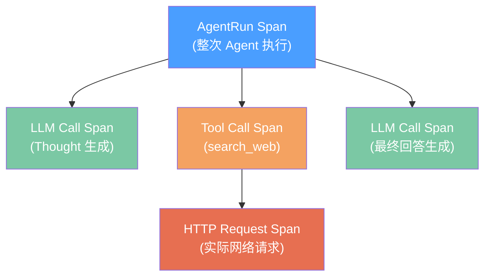

---
tags: [LLM, Agent, Observability, Monitoring, Tracing]
created: 2026-05-22
---

# Agent 可观测性 (Observability)

> 核心问题：**当 Agent 出错时，能在 5 分钟内定位到是哪个环节的问题吗？**  
> LLM 系统的非确定性使得传统监控手段不够用——需要专门的 Trace 体系。

---

## 一、为什么 LLM 系统的可观测性更难

| 传统服务 | LLM Agent 系统 |
|---------|----------------|
| 输入输出确定 | 输出非确定，同一输入结果可能不同 |
| 失败有明确异常 | "幻觉"不会抛异常，但结果是错的 |
| 延迟稳定 | TTFT/TPS 波动大，受 KV Cache 影响 |
| 成本固定 | Token 消耗随输入/输出长度变化 |
| 调用链简单 | Thought→Tool→Observation 多层嵌套 |

---

## 二、Span 数据模型



```python
import time
import uuid
import json
from dataclasses import dataclass, field
from typing import Any
from enum import Enum
from contextlib import contextmanager


class SpanType(str, Enum):
    AGENT_RUN = "agent_run"
    LLM_CALL = "llm_call"
    TOOL_CALL = "tool_call"
    RETRIEVAL = "retrieval"
    RERANK = "rerank"
    HTTP_REQUEST = "http_request"


@dataclass
class Span:
    """单个追踪 Span（代表一次操作的记录）"""
    span_id: str = field(default_factory=lambda: str(uuid.uuid4())[:8])
    parent_id: str | None = None
    trace_id: str = field(default_factory=lambda: str(uuid.uuid4())[:16])
    span_type: SpanType = SpanType.LLM_CALL
    name: str = ""
    start_time: float = field(default_factory=time.monotonic)
    end_time: float | None = None
    duration_ms: float | None = None
    # LLM 相关
    model: str | None = None
    prompt_tokens: int = 0
    completion_tokens: int = 0
    total_tokens: int = 0
    # 输入输出（可选，可能包含敏感信息，生产中可关闭）
    input_preview: str = ""   # 截断后的输入预览
    output_preview: str = ""  # 截断后的输出预览
    # 工具相关
    tool_name: str | None = None
    tool_args: dict = field(default_factory=dict)
    # 状态
    status: str = "ok"   # ok | error | timeout
    error_msg: str | None = None
    # 自定义标签（用于过滤和聚合）
    tags: dict[str, str] = field(default_factory=dict)

    def finish(self, status: str = "ok", error: str | None = None):
        self.end_time = time.monotonic()
        self.duration_ms = (self.end_time - self.start_time) * 1000
        self.status = status
        self.error_msg = error

    def to_dict(self) -> dict:
        return {
            "span_id": self.span_id,
            "trace_id": self.trace_id,
            "parent_id": self.parent_id,
            "type": self.span_type.value,
            "name": self.name,
            "duration_ms": round(self.duration_ms or 0, 2),
            "tokens": self.total_tokens,
            "status": self.status,
            "error": self.error_msg,
            "tags": self.tags,
        }
```

---

## 三、AgentTracer — 完整追踪实现

```python
import threading
from collections import defaultdict


class AgentTracer:
    """
    轻量级 Agent 追踪器
    
    线程安全，支持嵌套 Span（通过 thread-local 维护当前 Span 栈）
    生产中可对接 OpenTelemetry 或 LangSmith
    """

    def __init__(self):
        self._spans: list[Span] = []
        self._lock = threading.Lock()
        self._local = threading.local()  # 线程本地变量，存储当前 Span 栈

    def _current_span(self) -> Span | None:
        stack = getattr(self._local, "stack", [])
        return stack[-1] if stack else None

    @contextmanager
    def span(
        self,
        name: str,
        span_type: SpanType = SpanType.LLM_CALL,
        **tags,
    ):
        """上下文管理器：自动记录 Span 的开始和结束"""
        parent = self._current_span()
        s = Span(
            parent_id=parent.span_id if parent else None,
            trace_id=parent.trace_id if parent else str(uuid.uuid4())[:16],
            span_type=span_type,
            name=name,
            tags={k: str(v) for k, v in tags.items()},
        )

        # 入栈
        if not hasattr(self._local, "stack"):
            self._local.stack = []
        self._local.stack.append(s)

        try:
            yield s
            s.finish(status="ok")
        except Exception as e:
            s.finish(status="error", error=str(e))
            raise
        finally:
            # 出栈，记录 Span
            self._local.stack.pop()
            with self._lock:
                self._spans.append(s)

    def record_llm_call(
        self,
        span: Span,
        model: str,
        prompt_tokens: int,
        completion_tokens: int,
        input_text: str = "",
        output_text: str = "",
    ):
        """记录 LLM 调用的详细信息"""
        span.model = model
        span.prompt_tokens = prompt_tokens
        span.completion_tokens = completion_tokens
        span.total_tokens = prompt_tokens + completion_tokens
        span.input_preview = input_text[:200]   # 截断，避免日志过大
        span.output_preview = output_text[:200]

    def get_trace(self, trace_id: str) -> list[Span]:
        """获取一次 Agent 执行的完整 Trace"""
        with self._lock:
            return [s for s in self._spans if s.trace_id == trace_id]

    def print_trace(self, trace_id: str):
        """打印可读的 Trace 树（调试用）"""
        spans = self.get_trace(trace_id)
        if not spans:
            print("未找到 Trace")
            return

        print(f"\n{'='*60}")
        print(f"Trace: {trace_id}")
        for span in sorted(spans, key=lambda s: s.start_time):
            indent = "  " if span.parent_id else ""
            status_emoji = "✓" if span.status == "ok" else "✗"
            token_info = f"[{span.total_tokens}tok]" if span.total_tokens > 0 else ""
            print(
                f"{indent}{status_emoji} [{span.span_type.value}] {span.name} "
                f"- {span.duration_ms:.0f}ms {token_info}"
            )
            if span.error_msg:
                print(f"{indent}  └─ 错误: {span.error_msg}")
        print('='*60)


# 全局 Tracer 实例
tracer = AgentTracer()
```

---

## 四、@trace_span 装饰器

```python
import functools
from openai import OpenAI

client = OpenAI()


def trace_span(name: str = "", span_type: SpanType = SpanType.LLM_CALL, **static_tags):
    """
    自动追踪装饰器
    在函数前后自动创建/结束 Span，记录执行时间和异常
    """
    def decorator(func):
        @functools.wraps(func)
        def wrapper(*args, **kwargs):
            span_name = name or func.__name__
            with tracer.span(span_name, span_type=span_type, **static_tags) as span:
                return func(*args, span=span, **kwargs)
        return wrapper
    return decorator


# 使用示例
@trace_span("llm_generate", span_type=SpanType.LLM_CALL)
def generate_with_tracing(prompt: str, span: Span = None) -> str:
    """带追踪的 LLM 调用"""
    response = client.chat.completions.create(
        model="gpt-4o-mini",
        messages=[{"role": "user", "content": prompt}],
    )
    reply = response.choices[0].message.content

    # 记录 token 信息
    if span:
        tracer.record_llm_call(
            span=span,
            model="gpt-4o-mini",
            prompt_tokens=response.usage.prompt_tokens,
            completion_tokens=response.usage.completion_tokens,
            input_text=prompt,
            output_text=reply,
        )
    return reply
```

---

## 五、Token 成本追踪器

```python
from dataclasses import dataclass, field
from threading import Lock


# 各模型定价（美元/1M tokens）
MODEL_PRICING = {
    "gpt-4o": {"input": 2.50, "output": 10.00},
    "gpt-4o-mini": {"input": 0.15, "output": 0.60},
    "claude-opus-4": {"input": 15.00, "output": 75.00},
    "claude-sonnet-4": {"input": 3.00, "output": 15.00},
    "qwen-max": {"input": 0.04, "output": 0.12},  # 阿里云百炼
}


@dataclass
class TokenCostTracker:
    """
    Token 消耗与成本追踪器
    线程安全，支持多模型、多会话的成本汇总
    """
    budget_usd: float = 10.0   # 预算上限（美元）
    alert_threshold: float = 0.8  # 达到 80% 预算时告警

    _records: list[dict] = field(default_factory=list)
    _total_cost: float = field(default=0.0, init=False)
    _lock: Lock = field(default_factory=Lock, init=False)

    def record(
        self,
        model: str,
        prompt_tokens: int,
        completion_tokens: int,
        session_id: str = "default",
    ) -> float:
        """记录一次调用的 Token 消耗，返回本次成本（美元）"""
        pricing = MODEL_PRICING.get(model, {"input": 1.0, "output": 3.0})
        cost = (
            prompt_tokens * pricing["input"] / 1_000_000
            + completion_tokens * pricing["output"] / 1_000_000
        )

        with self._lock:
            self._total_cost += cost
            self._records.append({
                "model": model,
                "prompt_tokens": prompt_tokens,
                "completion_tokens": completion_tokens,
                "cost_usd": cost,
                "session_id": session_id,
                "timestamp": time.time(),
            })

        # 预算告警
        if self._total_cost >= self.budget_usd * self.alert_threshold:
            print(
                f"⚠ 成本告警：已消耗 ${self._total_cost:.4f} "
                f"({self._total_cost/self.budget_usd:.0%} 预算)"
            )
        if self._total_cost >= self.budget_usd:
            raise BudgetExceededError(
                f"已超出预算上限 ${self.budget_usd}！当前消耗 ${self._total_cost:.4f}"
            )

        return cost

    def summary(self) -> dict:
        """生成成本汇总报告"""
        with self._lock:
            by_model: dict[str, dict] = defaultdict(lambda: {"cost": 0, "tokens": 0, "calls": 0})
            for r in self._records:
                m = r["model"]
                by_model[m]["cost"] += r["cost_usd"]
                by_model[m]["tokens"] += r["prompt_tokens"] + r["completion_tokens"]
                by_model[m]["calls"] += 1

            return {
                "total_cost_usd": round(self._total_cost, 6),
                "budget_usd": self.budget_usd,
                "budget_used_pct": f"{self._total_cost/self.budget_usd:.1%}",
                "total_calls": len(self._records),
                "by_model": dict(by_model),
            }

    def print_summary(self):
        s = self.summary()
        print(f"\n💰 成本报告")
        print(f"  总消耗: ${s['total_cost_usd']:.6f} / ${s['budget_usd']} ({s['budget_used_pct']})")
        for model, data in s["by_model"].items():
            print(f"  {model}: ${data['cost']:.6f} ({data['calls']} 次, {data['tokens']} tokens)")


class BudgetExceededError(Exception):
    pass


# 全局成本追踪器
cost_tracker = TokenCostTracker(budget_usd=5.0)
```

---

## 六、失败归因分析器

```python
@dataclass
class FailureReport:
    trace_id: str
    root_cause_type: str   # intent_error | retrieval_miss | tool_failure | llm_hallucination
    failed_span: str
    analysis: str
    recommendations: list[str]


def analyze_failure(trace_id: str) -> FailureReport | None:
    """
    分析失败的 Trace，自动归因
    
    归因逻辑：
    1. 找出所有 status=error 的 Span
    2. 按 Span 类型判断根因类别
    3. 给出改进建议
    """
    spans = tracer.get_trace(trace_id)
    failed_spans = [s for s in spans if s.status == "error"]

    if not failed_spans:
        return None  # 没有明显失败，可能是幻觉（需要 Eval 检测）

    # 按时间排序，找最早的失败
    first_failure = min(failed_spans, key=lambda s: s.start_time)

    # 根据失败 Span 类型归因
    cause_map = {
        SpanType.RETRIEVAL: (
            "retrieval_miss",
            "检索阶段未能找到相关文档",
            ["检查 Embedding 模型是否匹配语言", "增加 BM25 混合检索", "扩大 Top-K 召回数量"],
        ),
        SpanType.TOOL_CALL: (
            "tool_failure",
            f"工具 '{first_failure.tool_name}' 调用失败",
            ["检查工具参数格式", "增加工具调用重试", "验证外部服务可用性"],
        ),
        SpanType.LLM_CALL: (
            "llm_error",
            "LLM 调用失败",
            ["检查 API Key 和 Rate Limit", "增加请求重试（指数退避）", "切换备用模型"],
        ),
    }

    span_type = first_failure.span_type
    if span_type in cause_map:
        cause_type, analysis, recommendations = cause_map[span_type]
    else:
        cause_type = "unknown"
        analysis = f"未知错误：{first_failure.error_msg}"
        recommendations = ["查看完整 Trace 日志", "联系 on-call 工程师"]

    return FailureReport(
        trace_id=trace_id,
        root_cause_type=cause_type,
        failed_span=first_failure.name,
        analysis=analysis,
        recommendations=recommendations,
    )


# 测试
def test_failure_analysis():
    with tracer.span("agent_run", span_type=SpanType.AGENT_RUN) as root_span:
        trace_id = root_span.trace_id
        with tracer.span("search_docs", span_type=SpanType.RETRIEVAL) as s:
            s.finish(status="error", error="向量数据库连接超时")

    report = analyze_failure(trace_id)
    if report:
        print(f"\n🔍 故障归因报告")
        print(f"  类型: {report.root_cause_type}")
        print(f"  失败环节: {report.failed_span}")
        print(f"  分析: {report.analysis}")
        print(f"  建议:")
        for rec in report.recommendations:
            print(f"    - {rec}")

test_failure_analysis()
```

---

## 七、关键 Metrics 滑动窗口统计

```python
from collections import deque
import statistics


class SlidingWindowMetrics:
    """
    滑动时间窗口内的指标统计
    用于实时监控 TTFT、TPS、成功率等
    """

    def __init__(self, window_seconds: float = 60.0):
        self.window = window_seconds
        self._ttft_records: deque[tuple[float, float]] = deque()   # (timestamp, ms)
        self._tps_records: deque[tuple[float, float]] = deque()    # (timestamp, tokens/s)
        self._success_records: deque[tuple[float, bool]] = deque() # (timestamp, success)
        self._lock = Lock()

    def _cleanup(self, records: deque):
        """移除窗口外的旧数据"""
        cutoff = time.monotonic() - self.window
        while records and records[0][0] < cutoff:
            records.popleft()

    def record_request(self, ttft_ms: float, tps: float, success: bool):
        now = time.monotonic()
        with self._lock:
            self._ttft_records.append((now, ttft_ms))
            self._tps_records.append((now, tps))
            self._success_records.append((now, success))

    def get_stats(self) -> dict:
        with self._lock:
            for records in [self._ttft_records, self._tps_records, self._success_records]:
                self._cleanup(records)

            ttft_values = [v for _, v in self._ttft_records]
            tps_values = [v for _, v in self._tps_records]
            success_values = [v for _, v in self._success_records]

        def safe_stats(values):
            if not values:
                return {"p50": 0, "p95": 0, "p99": 0, "mean": 0}
            sorted_v = sorted(values)
            n = len(sorted_v)
            return {
                "p50": sorted_v[int(n * 0.5)],
                "p95": sorted_v[int(n * 0.95)],
                "p99": sorted_v[int(n * 0.99)],
                "mean": statistics.mean(sorted_v),
            }

        return {
            "window_seconds": self.window,
            "request_count": len(success_values),
            "success_rate": sum(success_values) / len(success_values) if success_values else 0,
            "ttft_ms": safe_stats(ttft_values),
            "tps": safe_stats(tps_values),
        }

    def print_dashboard(self):
        stats = self.get_stats()
        print(f"\n📊 实时监控（最近 {stats['window_seconds']}s）")
        print(f"  请求数: {stats['request_count']}")
        print(f"  成功率: {stats['success_rate']:.1%}")
        print(f"  TTFT(ms): p50={stats['ttft_ms']['p50']:.0f} | p95={stats['ttft_ms']['p95']:.0f}")
        print(f"  TPS: p50={stats['tps']['p50']:.1f} | p95={stats['tps']['p95']:.1f}")


metrics = SlidingWindowMetrics(window_seconds=60.0)
# 模拟记录
for i in range(10):
    metrics.record_request(ttft_ms=150 + i*10, tps=30 + i, success=i != 7)
metrics.print_dashboard()
```

---

## 八、告警规则速查表

| 指标 | 告警阈值 | 严重级别 | 处理策略 |
|------|---------|---------|---------|
| **TTFT p99** | > 5000ms | Critical | 检查 KV Cache 命中率；扩容推理实例 |
| **成功率** | < 95% | Critical | 触发熔断；切换备用模型 |
| **Tool 调用成功率** | < 90% | Warning | 检查外部服务；增加重试逻辑 |
| **Faithfulness** | < 0.7 | Warning | 检索质量下降；Review Chunking 策略 |
| **Token 成本/小时** | > 预算 20% | Warning | 检查是否有异常请求；优化 Prompt 长度 |
| **Context 长度 p95** | > 80% max_tokens | Warning | 触发摘要压缩；检查 Sliding Window 配置 |
| **并发数** | > Semaphore 上限 80% | Info | 考虑扩容；调整限流参数 |
| **错误率（连续 5 次）** | 100% | Critical | 触发熔断器；规则引擎降级 |

---

*← [[agent-05-infra-performance]] | 返回索引 → [[agent-engineering-system]]*
